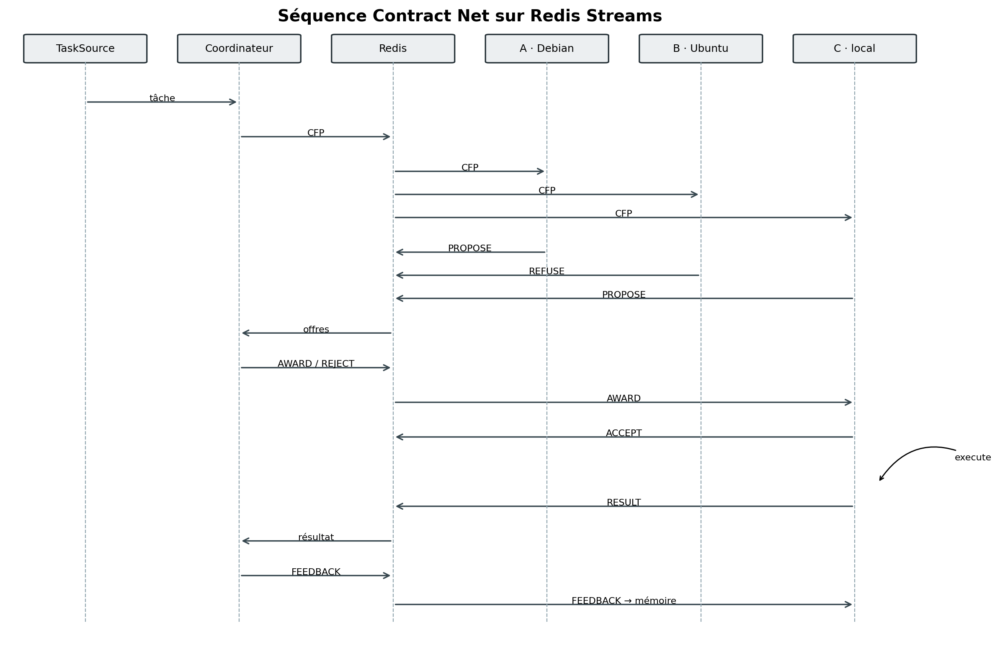
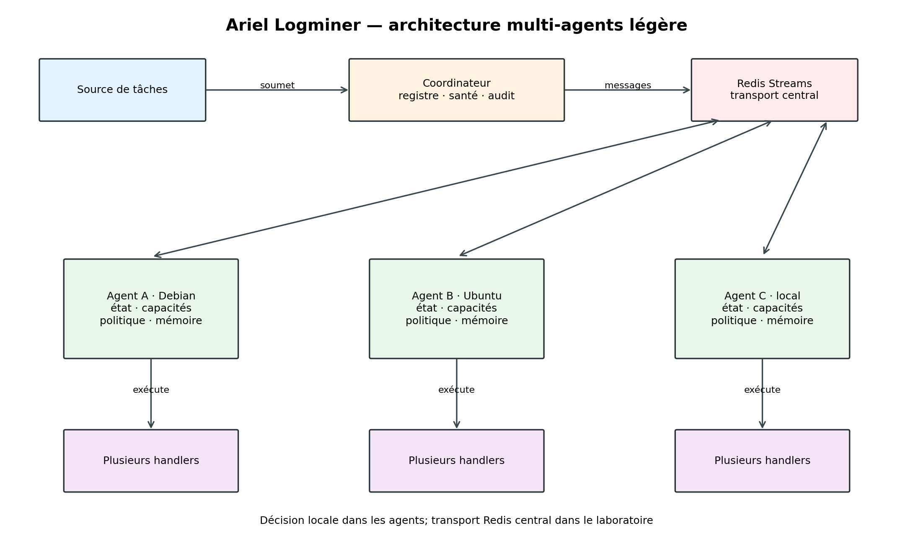

# Architecture multi-agents autonome légère de Logminer

## Portée

Cette architecture ajoute à Logminer une allocation négociée des tâches sans prétendre simuler une intelligence générale. Un agent reste un composant logiciel borné : il expose plusieurs capacités, observe son état local, calcule une utilité, accepte ou refuse une tâche, exécute un handler et met à jour une mémoire élémentaire. Le coordinateur ne calcule pas les offres à leur place; il tient le registre, diffuse les appels, compare les propositions reçues et conserve la trace du protocole.

Le workflow historique piloté par `supervisor_agent.py` est conservé. Il sert de référence centralisée et n'est pas présenté comme le nouveau chemin autonome.

## Composants

| Composant | Responsabilité | Fichier |
|---|---|---|
| `MultiTaskIntelligentAgent` | capacités, handlers, perception locale, offre, refus, acceptation, exécution et apprentissage | `src/logminer/agents/intelligent_runtime.py` |
| `ContractNetCoordinator` | registre, diffusion du CFP, classement des offres, attribution, rejet, feedback et audit des messages | `src/logminer/agents/contract_net.py` |
| `SQLiteIdempotencyStore` | réservation d'une clé, résultat durable, détection d'une reprise et suppression d'une réservation échouée | `src/logminer/agents/idempotency.py` |
| `RedisIdempotencyStore` | idempotence commune à plusieurs processus par clé Redis atomiquement réservée | `src/logminer/agents/idempotency.py` |
| `RedisContractNetTransport` | boîtes Redis par agent, flux de réponses, registre de run et séparation entre contrat et ID de Stream | `src/logminer/agents/redis_contract_net.py` |
| `LocalMessageBus` | trace JSONL locale append-only | `src/logminer/agents/bus.py` |
| `RedisMessageBus` | enveloppe Redis Streams, groupes de consommateurs, ACK, pending et `XAUTOCLAIM` | `src/logminer/agents/bus.py` |

## Contrat de message préservé

`AgentMessage` conserve exactement sept champs :

```text
run_id
source
target
message_type
payload
status
timestamp
```

`contract_id`, `task_id`, `idempotency_key`, `end_to_end_run_id`, les composantes d'utilité et les motifs de refus sont des valeurs de `payload`. L'identifiant produit par `XADD` reste une propriété de l'enveloppe Redis Streams. Il ne constitue ni un huitième champ métier ni un identifiant d'événement ajouté à `AgentMessage`.

## Cycle Contract Net

| Message | Émetteur | Destinataire | Contenu utile dans `payload` |
|---|---|---|---|
| `CFP` | coordinateur | agents enregistrés | contrat, tâche, clé d'idempotence, run bout en bout |
| `PROPOSE` | agent | coordinateur | utilité normalisée, composantes et raisons |
| `REFUSE` | agent | coordinateur | motif standardisé et étape du refus |
| `AWARD` | coordinateur | agent retenu | contrat, tâche et offre retenue |
| `REJECT` | coordinateur | autres proposants | contrat, offre rejetée et gagnant |
| `ACCEPT` | agent retenu | coordinateur | confirmation de réservation locale |
| `RESULT` | agent | coordinateur | résultat sérialisé de la tâche |
| `FAIL` | agent ou coordinateur | coordinateur ou superviseur | erreur d'exécution ou absence de proposition |
| `FEEDBACK` | coordinateur | agent exécutant | résultat observé, utilité et durée |

Une négociation nominale avec trois proposants produit dix messages : un `CFP`, trois `PROPOSE`, un `AWARD`, deux `REJECT`, un `ACCEPT`, un `RESULT` et un `FEEDBACK`. La topologie varie si un agent refuse avant l'attribution ou si une attribution doit être reprise.



## État et décision locale

Chaque agent publie ou expose :

- ses capacités et handlers;
- `healthy`;
- `active_tasks` et `max_parallel_tasks`;
- un ratio de charge borné entre 0 et 1;
- les modèles et dépendances disponibles;
- l'état du commutateur de mémoire;
- les succès, échecs et durées historiques lorsque la mémoire est active.

Le score local est :

```text
U = 0,30 × capacité
  + 0,20 × historique
  + 0,20 × modèle
  + 0,15 × disponibilité
  + 0,10 × charge
  + 0,05 × latence
```

Toutes les composantes sont bornées entre 0 et 1. La fiabilité historique suit `(s+1)/(s+f+2)`. Sans observation, elle vaut donc 0,5. En mode mémoire OFF, la composante historique est maintenue à 0,5 et aucune nouvelle exécution n'est apprise ou persistée.

Ces poids sont une configuration initiale imposée par le protocole expérimental. Ils ne sont ni appris ni revendiqués comme optimaux.

## Refus

Les motifs implémentés sont :

- `capability_missing`;
- `model_missing`;
- `agent_overloaded`;
- `agent_unhealthy`;
- `low_expected_utility`;
- `dependency_unavailable`.

Le refus précède l'offre lorsque l'incompatibilité est connue. Une saturation apparue entre la proposition et l'attribution peut aussi provoquer un refus au stade de l'acceptation.

## Idempotence et reprise

La clé `idempotency_key` est portée par le payload de la tâche. Avant le handler, l'agent interroge le registre SQLite. Trois états sont distingués : réservation obtenue, traitement déjà en cours et résultat déjà terminé. Après succès, le résultat est écrit durablement avant l'ACK du transport. Si un second agent reprend la même tâche après ce point, il relit le résultat et n'appelle pas le handler une seconde fois.

Cette garantie porte sur le résultat enregistré par le registre. Pour un effet externe arbitraire, l'atomicité exige que l'effet et la validation d'idempotence partagent une même transaction ou que le système externe accepte lui-même la clé. La campagne locale vérifie le cas contrôlé « résultat persistant puis crash avant ACK »; elle ne prouve pas l'atomicité de tout effet tiers.

## Rôle du superviseur

Dans le chemin autonome, le coordinateur/superviseur est limité à :

- enregistrer les agents et leurs heartbeats;
- constater la santé et la charge annoncées;
- diffuser les CFP;
- comparer les utilités calculées par les agents;
- gérer les délais, les rejets et les reprises;
- écrire les traces d'audit.

Il ne détermine pas la valeur des composantes locales et ne choisit pas impérativement un worker avant la consultation des agents. Le superviseur historique, qui sélectionne une source puis exécute le workflow, reste disponible comme architecture centralisée de comparaison.

## Distribution Redis

Le transport inter-processus utilise une boîte Redis Stream par agent et un flux de réponses propre au run. Le coordinateur écrit un `CFP` dans chacune des boîtes enregistrées. Chaque processus lit sa boîte, calcule son offre avec son propre état puis écrit `PROPOSE` ou `REFUSE` dans le flux partagé. `AWARD`, `REJECT` et `FEEDBACK` reviennent par les boîtes individuelles.

La campagne `redis_cnp_20260909T162814Z_47940` a exécuté trois processus Python distincts sur le même hôte, avec les PID 45400, 22104 et 34288. Redis 7.4.9 a transporté les messages; 60/60 tâches ont réussi.

La campagne `multivm_cnp_20260909T202632Z_37592` a ensuite lancé `debian-alpha` dans Debian 13 et `ubuntu-beta` dans Ubuntu/Linux Lite 5.4. Les deux agents invités ont exécuté 60/60 tâches avec une répartition 30/30. Les traces contiennent 15 `REFUSE`, un `FAIL` contrôlé suivi d'une nouvelle attribution, puis un replay idempotent exécuté par l'autre VM avec zéro effet dupliqué. Redis reste centralisé sur l'hôte Windows du laboratoire.



## Statut de validation

| Élément | Statut | Preuve |
|---|---|---|
| Contrat à sept champs | TESTÉ | `tests/test_true_multi_agent.py` |
| Neuf types de messages CNP | TESTÉ ET ÉVALUÉ LOCALEMENT | tests et logs de `experiments/phase_multi_agent/` |
| Six motifs de refus | TESTÉ | `tests/test_true_multi_agent.py` |
| Mémoire ON/OFF | TESTÉ ET ÉVALUÉ LOCALEMENT | tests, campagne A/B/C/D et adaptation |
| Idempotence post-traitement/pré-ACK | TESTÉ ET ÉVALUÉ DANS UN HARNAIS CONTRÔLÉ | JSON et base SQLite du run |
| Pipeline Logminer en huit étapes | ÉVALUÉ LOCALEMENT | artefact `end_to_end.json`, audit, snapshot API et log JSONL |
| Négociation Redis inter-processus | ÉVALUÉE SUR UN HÔTE | run `redis_cnp_20260909T162814Z_47940`, trois PID distincts |
| Agents autonomes Debian/Ubuntu | ÉVALUÉS EN LABORATOIRE | run `multivm_cnp_20260909T202632Z_37592`, deux OS/hôtes/PID, 60/60 tâches, 15 refus, 1 réattribution |
| Production ou environnement industriel | HORS PÉRIMÈTRE | aucune preuve disponible |
