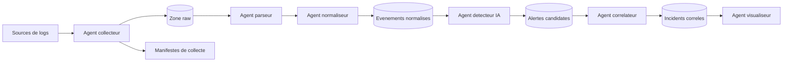
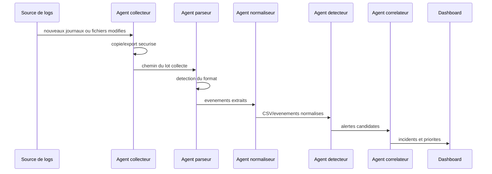

# Objectif 3 - Architecture multi-agents IA

Ce document formalise l'objectif 3 du memoire:

> Concevoir une architecture distribuee et modulaire basee sur des agents IA specialises pour la surveillance et l'analyse des journaux systemes et reseaux.

L'architecture proposee transforme des journaux heterogenes en alertes exploitables. Chaque agent est responsable d'une etape precise, ce qui permet de tester, remplacer ou deployer les composants progressivement.

## Principes De Conception

- Modularite: chaque agent a une responsabilite limitee et une interface claire.
- Resilience: l'echec d'un agent ne doit pas faire perdre les journaux bruts.
- Scalabilite: les agents de collecte/parsing peuvent etre multiplies par source de logs.
- Explicabilite: chaque transformation doit pouvoir etre reliee au log d'origine.
- Legerete: le systeme doit fonctionner sur une machine standard, sans infrastructure SOC lourde.

## Agents Proposes

| Agent | Role | Entree | Sortie | Etat actuel dans le projet |
| --- | --- | --- | --- | --- |
| Agent collecteur | Recupere les journaux locaux ou distants | Fichiers `.evtx`, `.log`, `.pcap`, exports XML/CSV | Copies brutes et manifeste | `scripts/collect_windows_events.ps1` |
| Agent parseur | Detecte le format et extrait les champs utiles | Logs bruts | Evenements structures | `src/logminer/pipeline.py`, `parsers/` |
| Agent normaliseur | Harmonise les champs, severites et categories | Evenements structures | CSV normalise | `io/csv_writer.py`, `schema/columns.py`, `normalizers/` |
| Agent detecteur | Identifie les anomalies avec regles ou IA legere | CSV normalise, flux d'evenements | Alertes candidates | `src/logminer/agents/detector.py` |
| Agent correlateur | Regroupe les alertes liees dans le temps/contexte | Alertes candidates | Incidents correles | `src/logminer/agents/correlator.py` |
| Agent visualiseur | Presente les logs, alertes et indicateurs | Incidents, alertes, statistiques | `src/logminer/agents/dashboard.py`, `web/dashboard/` |

## Architecture Logique



## Flux De Donnees

Le flux cible est le suivant:

```text
logs actifs -> copies brutes -> parsing -> normalisation -> detection -> correlation -> dashboard
```

Pour les journaux Windows, le flux deja implemente est:

```text
C:\Windows\System32\winevt\Logs
    -> scripts/collect_windows_events.ps1
    -> data/raw/windows_events/<run_id>/*.evtx
    -> src/logminer/pipeline.py
    -> data/processed/windows_copies_pipeline.csv
```

## Diagramme De Sequence



## Contrat D'Evenement Normalise

Le contrat commun est defini par `src/logminer/schema/columns.py`. Les champs les plus importants pour les agents suivants sont:

| Champ | Role |
| --- | --- |
| `timestamp_iso` | Ordonner les evenements et calculer les fenetres temporelles |
| `severity` | Prioriser les signaux faibles ou critiques |
| `event` | Identifier un type d'evenement ou code Windows/Linux/applicatif |
| `source` | Provider, service ou application emettrice |
| `host` | Machine concernee |
| `user` | Identite associee a l'evenement |
| `src_ip`, `dst_ip`, `src_port`, `dst_port` | Contexte reseau |
| `category`, `subcategory` | Classification securite interpretable |
| `message` | Texte brut nettoye pour analyse semantique ou vectorisation |

## Protocoles D'Interaction

Le prototype peut evoluer en trois niveaux.

| Niveau | Technologie | Usage | Quand l'utiliser |
| --- | --- | --- | --- |
| Local simple | Fichiers CSV + dossiers `data/` | Prototype, tests de datasets, memoire | Maintenant |
| Services REST | FastAPI | Agents executables separement avec endpoints clairs | Quand le detecteur IA est ajoute |
| Bus d'evenements | Redis Streams, MQTT ou sockets | Flux quasi temps reel et agents distribues | Redis Streams pour jobs/workers; MQTT maintenant pour pub/sub leger |

Le choix retenu pour stabiliser le prototype et organiser les evolutions du
memoire est:

```text
V1: fichiers CSV + CLI + bus local JSONL, version de secours defendable
V2: FastAPI pour exposer parseur/detecteur/correlateur/dashboard
V3: Redis Streams optionnel deja integre, file de jobs et workers; MQTT optionnel pour pub/sub temps reel leger
```

La V1 est la version stable du memoire et doit rester fonctionnelle. La
trajectoire V2/V3 fait aussi partie du memoire, mais elle est construite
au-dessus de la V1 pour ne pas perdre les avancees deja validees. Elle est
documentee dans `docs/architecture/v1_cli_v2_services.md`. Le premier service
FastAPI V2 et le bus Redis Streams optionnel sont documentes dans
`docs/architecture/v2_fastapi.md`.

## Entrainement Cloud Et Artefacts Modeles

Les grands datasets, par exemple HDFS complet, BGL complet ou UNSW-NB15, ne
doivent pas forcement etre entraines sur la machine locale. Le flux recommande
est:

```text
dataset volumineux -> entrainement cloud -> artefact joblib -> inference locale
```

L'agent detecteur supporte maintenant deux modes:

| Mode | Option | Usage |
| --- | --- | --- |
| Entrainement + scoring | `--model-out` | Entraine Isolation Forest et sauvegarde le modele |
| Inference seule | `--model-in` | Recharge un modele joblib et score un nouveau CSV |

Exemple d'entrainement sur le cloud:

```powershell
python src\logminer\agents\detector.py `
  -i data\processed\cloud_training_dataset.csv `
  -o data\processed\cloud_training_anomalies.csv `
  --contamination 0.02 `
  --model-out models\isolation_forest_hdfs_bgl.joblib
```

Exemple d'inference locale avec le modele recupere:

```powershell
python src\logminer\agents\detector.py `
  -i data\processed\windows_copies_pipeline.csv `
  -o data\processed\anomalies_from_cloud_model.csv `
  --model-in models\isolation_forest_hdfs_bgl.joblib
```

L'artefact sauvegarde:

- le modele `IsolationForest`;
- l'ordre exact des colonnes de features;
- les parametres d'entrainement;
- la date d'entrainement;
- le nombre de lignes utilisees.

Cette structure evite un probleme classique: les colonnes one-hot peuvent
changer entre entrainement et inference. Au chargement, le detecteur realigne
automatiquement les features sur le schema appris.

La phase 2 est implementee avec `src/logminer/agents/bus.py`. Chaque agent publie des messages dans `data/processed/agent_messages.jsonl`.
Le contrat complet des messages agents est formalise dans
`docs/architecture/message_contract.md`; il s'applique au bus JSONL local et au
bus Redis Streams.

Exemple de sequence de messages:

```text
workflow.started
parse.started
parse.completed
detection.started
detection.completed
workflow.completed
```

## Lecture Humaine Des Messages Agents

Les messages du bus local sont volontairement structurés pour la machine, mais
ils doivent rester lisibles pour un analyste ou un developpeur. Le dashboard web
traduit donc les informations techniques en trois niveaux:

| Niveau affiche | Source technique | Utilite humaine |
| --- | --- | --- |
| Etape | `message_type` | Comprendre ce que le workflow est en train de faire |
| Acteurs | `source` -> `target` | Identifier quel agent a parle a quel agent |
| Details | `payload` | Voir les fichiers produits, volumes d'evenements ou fenetres de correlation |

Exemple de traduction:

| Message brut | Presentation dashboard |
| --- | --- |
| `parse.completed` | Parsing termine |
| `detection.completed` | Detection terminee |
| `correlation.completed` | Correlation terminee |
| `parser -> detector` | Parseur -> Detecteur IA |

Cette presentation evite d'exposer directement du JSON a l'utilisateur final.
Le JSON reste disponible dans le journal brut, mais l'ecran principal privilegie
un fil chronologique comprehensible.

## Verification Quasi Temps Reel Et Robustesse

Deux scripts donnent des preuves reproductibles pour les objectifs 4, 6 et 7:

```powershell
python scripts\benchmark_realtime_workflow.py --cycles 5 --interval-sec 5
python scripts\run_robustness_scalability_checks.py
```

Le premier mesure la latence d'un workflow autonome appele toutes les cinq
secondes au plus. Le second verifie la detection multi-source et le maintien des
lignes inconnues/corrompues au lieu de les perdre. Les rapports produits sont:

- `data/processed/realtime_workflow_benchmark.csv`;
- `data/processed/robustness_scalability_report.csv`.

## Presentation Des Incidents

Un incident doit etre plus lisible qu'un groupe technique de lignes CSV. Le
dashboard affiche maintenant:

- un resume court genere par le correlateur;
- la severite maximale du groupe;
- le nombre d'evenements concernes;
- la categorie et la fenetre temporelle;
- les incidents les plus importants en premier.

Cette presentation sert de pont entre l'objectif 2, qui produit des anomalies,
et l'objectif 3, qui les rend exploitables dans une architecture multi-agents.

## Endpoints De La V2

Les endpoints FastAPI exposent les agents principaux tout en gardant la V1 CLI
comme socle stable.

| Agent | Endpoint | Methode | Description |
| --- | --- | --- | --- |
| Collecteur | `/collect/discover` | `POST` | Decouvre automatiquement les journaux candidats |
| Collecteur privilegie | `/collect/windows/privileged` | `POST` | Demande une collecte Windows sensible via UAC |
| Parseur | `/parse` | `POST` | Parse un fichier ou dossier brut |
| Detecteur | `/detect` | `POST` | Retourne les anomalies candidates |
| Correlateur | `/correlate` | `POST` | Regroupe les alertes en incidents |
| Orchestrateur | `/run` | `POST` | Lance parsing optionnel, detection et correlation |
| Orchestrateur autonome | `/run/discovered` | `POST` | Decouvre une source puis lance l'analyse |
| Analyste | `/alerts/decision` | `POST` | Valide, rejette ou reclasse une alerte avec audit |
| Visualiseur | `/audit`, `/events`, `/resources`, `/models` | `GET` | Alimente le dashboard |

## Etat Actuel

Ce qui existe deja:

- collecte Windows automatisee;
- copie de journaux `.evtx` dans `data/raw/windows_events/<run_id>`;
- parsing Windows Event XML/EVTX;
- detection heuristique de formats;
- ecriture CSV normalisee.
- normalisation semantique des severites et categories;
- conversion des evenements normalises en features ML;
- premier agent detecteur Isolation Forest.
- sauvegarde et chargement de modeles `joblib` pour entrainement cloud;
- communication locale entre agents avec bus JSONL;
- orchestrateur local parseur -> detecteur.
- agent correlateur produisant `incidents.csv`;
- dashboard Streamlit pour prototype rapide;
- dashboard React responsive pour une interface plus soignee;
- affichage humain du flux agents, des incidents et des resultats de validation.
- explication LLM optionnelle dans le dashboard React, avec repli local si aucune
  cle API n'est configuree.

Ce qui reste a construire:

- enrichissement des regles de correlation;
- stockage persistant des alertes/incidents;
- strategie de versionnement des modeles entraines sur le cloud;
- trajectoire FastAPI/Redis documentee comme V2/V3.

## Roadmap Technique

1. Fait: reparer `normalizers/runner.py` et `normalizers/categorizer.py`.
2. Fait: ajouter `src/logminer/features/` pour convertir les CSV en features ML.
3. Fait: ajouter un agent detecteur `src/logminer/agents/detector.py`.
4. Fait: produire `data/processed/anomalies.csv` avec Isolation Forest.
5. Fait: ajouter la communication locale entre agents avec `src/logminer/agents/bus.py`.
6. Fait: ajouter l'orchestrateur local `src/logminer/agents/orchestrator.py`.
7. Fait: ajouter un correlateur simple base sur fenetres temporelles.
8. Fait: construire un dashboard Streamlit lisant les CSV produits.
9. Fait: ajouter un dashboard React responsive avec API locale Node.
10. Fait: rendre lisibles les communications agents et les incidents dans le dashboard.
11. Fait: ajouter une explication analyste avec LLM optionnel pour rendre les
    resultats exploitables par un humain.
12. Rediger et stabiliser la V1 CLI; construire FastAPI/Redis ensuite comme
    V2/V3 du memoire.

Commande de detection:

```powershell
python src\logminer\agents\detector.py -i data\processed\windows_copies_pipeline.csv -o data\processed\anomalies.csv
```

Commande d'orchestration locale:

```powershell
python src\logminer\agents\orchestrator.py -i data\raw\windows_events\20260518_101329 --parsed-name windows_copies_pipeline.csv --anomalies-name anomalies.csv --incidents-name incidents.csv
```

Commande dashboard:

```powershell
streamlit run src\logminer\agents\dashboard.py
```

Commande dashboard React:

```powershell
cd web\dashboard
npm run dev
```

URL:

```text
http://127.0.0.1:5173
```

Explication LLM optionnelle:

```powershell
$env:OPENAI_API_KEY="votre-cle-api"
$env:OPENAI_MODEL="gpt-5.2"
cd web\dashboard
npm run dev
```

Le serveur expose `/api/explain`. Le navigateur envoie seulement un instantane
compact du dashboard; la cle API reste dans l'environnement du processus Node.
Sans `OPENAI_API_KEY`, le serveur retourne une synthese locale deterministe pour
conserver une demonstration utilisable hors ligne.

## Position Dans Le Memoire

Cette architecture correspond au chapitre 3:

- description des agents et de leurs roles;
- modele logique global;
- flux de traitement;
- strategie de communication;
- justification de la modularite et de la resilience.
