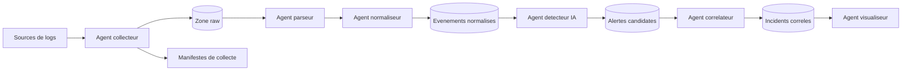
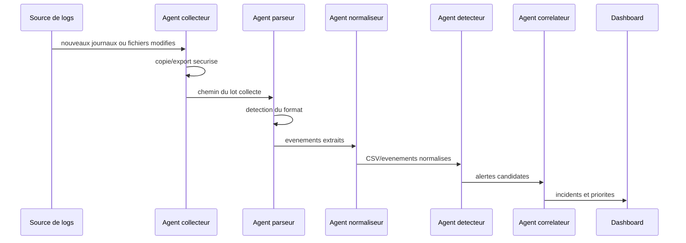

# Objectif 3 - Architecture multi-agents IA

Ce document formalise l'objectif 3 du memoire:

> Concevoir une architecture distribuee et modulaire basee sur des agents IA specialises pour la surveillance et l'analyse des journaux systemes et reseaux.

L'architecture proposee transforme des journaux heterogenes en alertes exploitables. Chaque agent est responsable d'une etape precise, ce qui permet de tester, remplacer ou deployer les composants progressivement.

## Principes De Conception

- Modularite: chaque agent a une responsabilite limitee et une interface claire.
- Resilience: l'echec d'un agent ne doit pas faire perdre les journaux bruts.
- Scalabilite: les agents de collecte/parsing peuvent etre multiplies par source de logs.
- Explicabilite: chaque transformation doit pouvoir etre reliee au log d'origine.
- Legerete: le systeme doit fonctionner sur une machine standard, sans infrastructure SOC lourde.

## Agents Proposes

| Agent | Role | Entree | Sortie | Etat actuel dans le projet |
| --- | --- | --- | --- | --- |
| Agent collecteur | Recupere les journaux locaux ou distants | Fichiers `.evtx`, `.log`, `.pcap`, exports XML/CSV | Copies brutes et manifeste | `scripts/collect_windows_events.ps1` |
| Agent parseur | Detecte le format et extrait les champs utiles | Logs bruts | Evenements structures | `src/logminer/pipeline.py`, `parsers/` |
| Agent normaliseur | Harmonise les champs, severites et categories | Evenements structures | CSV normalise | `io/csv_writer.py`, `schema/columns.py`, `normalizers/` |
| Agent detecteur | Identifie les anomalies avec regles ou IA legere | CSV normalise, flux d'evenements | Alertes candidates | `src/logminer/agents/detector.py` |
| Agent correlateur | Regroupe les alertes liees dans le temps/contexte | Alertes candidates | Incidents correles | `src/logminer/agents/correlator.py` |
| Agent visualiseur | Presente les logs, alertes et indicateurs | Incidents, alertes, statistiques | `src/logminer/agents/dashboard.py`, `web/dashboard/` |

## Architecture Logique



## Flux De Donnees

Le flux cible est le suivant:

```text
logs actifs -> copies brutes -> parsing -> normalisation -> detection -> correlation -> dashboard
```

Pour les journaux Windows, le flux deja implemente est:

```text
C:\Windows\System32\winevt\Logs
    -> scripts/collect_windows_events.ps1
    -> data/raw/windows_events/<run_id>/*.evtx
    -> src/logminer/pipeline.py
    -> data/processed/windows_copies_pipeline.csv
```

## Diagramme De Sequence



## Contrat D'Evenement Normalise

Le contrat commun est defini par `src/logminer/schema/columns.py`. Les champs les plus importants pour les agents suivants sont:

| Champ | Role |
| --- | --- |
| `timestamp_iso` | Ordonner les evenements et calculer les fenetres temporelles |
| `severity` | Prioriser les signaux faibles ou critiques |
| `event` | Identifier un type d'evenement ou code Windows/Linux/applicatif |
| `source` | Provider, service ou application emettrice |
| `host` | Machine concernee |
| `user` | Identite associee a l'evenement |
| `src_ip`, `dst_ip`, `src_port`, `dst_port` | Contexte reseau |
| `category`, `subcategory` | Classification securite interpretable |
| `message` | Texte brut nettoye pour analyse semantique ou vectorisation |

## Protocoles D'Interaction

Le prototype peut evoluer en trois niveaux.

| Niveau | Technologie | Usage | Quand l'utiliser |
| --- | --- | --- | --- |
| Local simple | Fichiers CSV + dossiers `data/` | Prototype, tests de datasets, memoire | Maintenant |
| Services REST | FastAPI | Agents executables separement avec endpoints clairs | Quand le detecteur IA est ajoute |
| Bus d'evenements | Redis, MQTT ou sockets | Flux quasi temps reel et agents distribues | Quand plusieurs sources tournent en parallele |

Le choix recommande pour le prototype est:

```text
Phase 1: fichiers CSV
Phase 2: bus local JSONL pour tracer la communication entre agents
Phase 3: FastAPI pour exposer parseur/detecteur/dashboard
Phase 4: Redis ou MQTT si le flux temps reel devient necessaire
```

La phase 2 est implementee avec `src/logminer/agents/bus.py`. Chaque agent publie des messages dans `data/processed/agent_messages.jsonl`.

Exemple de sequence de messages:

```text
workflow.started
parse.started
parse.completed
detection.started
detection.completed
workflow.completed
```

## Endpoints Cibles

Ces endpoints ne sont pas encore implementes; ils servent de specification pour la suite.

| Agent | Endpoint | Methode | Description |
| --- | --- | --- | --- |
| Collecteur | `/collect/windows` | `POST` | Lance une collecte Windows recente |
| Parseur | `/parse` | `POST` | Parse un fichier ou dossier brut |
| Normaliseur | `/normalize` | `POST` | Normalise un lot d'evenements |
| Detecteur | `/detect` | `POST` | Retourne les anomalies candidates |
| Correlateur | `/correlate` | `POST` | Regroupe les alertes en incidents |
| Visualiseur | `/alerts` | `GET` | Liste les alertes et incidents |

## Etat Actuel

Ce qui existe deja:

- collecte Windows automatisee;
- copie de journaux `.evtx` dans `data/raw/windows_events/<run_id>`;
- parsing Windows Event XML/EVTX;
- detection heuristique de formats;
- ecriture CSV normalisee.
- normalisation semantique des severites et categories;
- conversion des evenements normalises en features ML;
- premier agent detecteur Isolation Forest.
- communication locale entre agents avec bus JSONL;
- orchestrateur local parseur -> detecteur.
- agent correlateur produisant `incidents.csv`;
- dashboard Streamlit pour prototype rapide;
- dashboard React responsive pour une interface plus soignee.

Ce qui reste a construire:

- enrichissement des regles de correlation;
- stockage persistant des alertes/incidents;
- endpoints FastAPI pour agents separes.

## Roadmap Technique

1. Fait: reparer `normalizers/runner.py` et `normalizers/categorizer.py`.
2. Fait: ajouter `src/logminer/features/` pour convertir les CSV en features ML.
3. Fait: ajouter un agent detecteur `src/logminer/agents/detector.py`.
4. Fait: produire `data/processed/anomalies.csv` avec Isolation Forest.
5. Fait: ajouter la communication locale entre agents avec `src/logminer/agents/bus.py`.
6. Fait: ajouter l'orchestrateur local `src/logminer/agents/orchestrator.py`.
7. Fait: ajouter un correlateur simple base sur fenetres temporelles.
8. Fait: construire un dashboard Streamlit lisant les CSV produits.
9. Fait: ajouter un dashboard React responsive avec API locale Node.
10. Ajouter ensuite FastAPI si les agents doivent tourner comme services separes.

Commande de detection:

```powershell
python src\logminer\agents\detector.py -i data\processed\windows_copies_pipeline.csv -o data\processed\anomalies.csv
```

Commande d'orchestration locale:

```powershell
python src\logminer\agents\orchestrator.py -i data\raw\windows_events\20260518_101329 --parsed-name windows_copies_pipeline.csv --anomalies-name anomalies.csv --incidents-name incidents.csv
```

Commande dashboard:

```powershell
streamlit run src\logminer\agents\dashboard.py
```

Commande dashboard React:

```powershell
cd web\dashboard
npm run dev
```

URL:

```text
http://127.0.0.1:5173
```

## Position Dans Le Memoire

Cette architecture correspond au chapitre 3:

- description des agents et de leurs roles;
- modele logique global;
- flux de traitement;
- strategie de communication;
- justification de la modularite et de la resilience.
