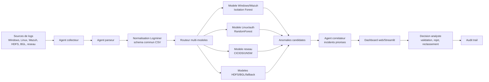
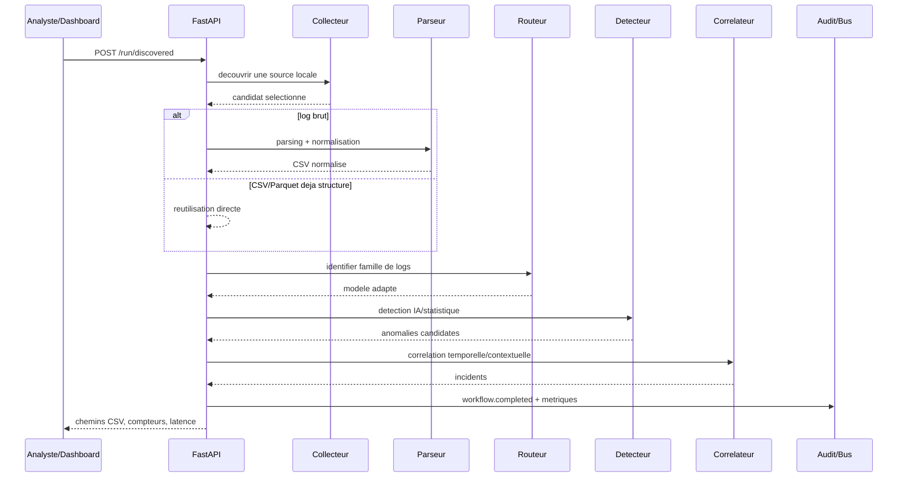
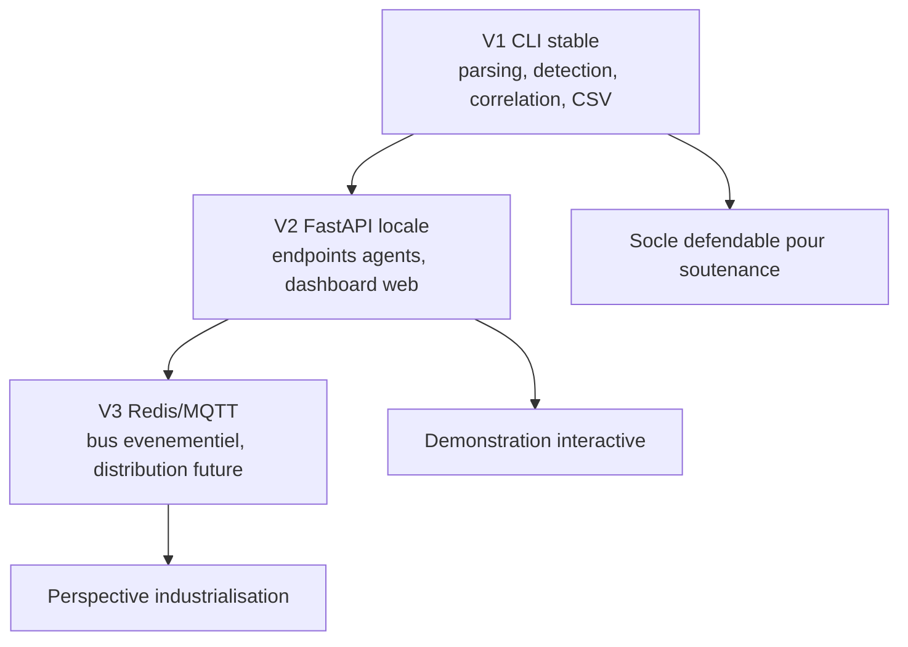
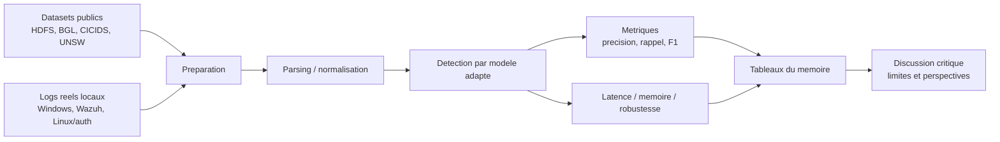

# Diagrammes Pour Le Memoire

Ces diagrammes completent les figures SVG generees dans
`docs/memoire/figures`. Ils sont ecrits en Mermaid pour rester faciles a
modifier et exporter.

## Architecture Generale

## Sequence Du Workflow V2 FastAPI

## Positionnement V1 / V2 / V3

## Cycle D'Evaluation

